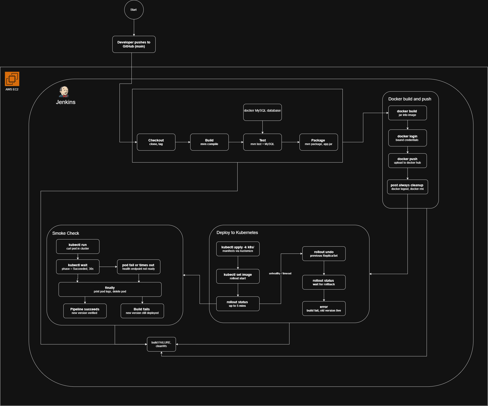
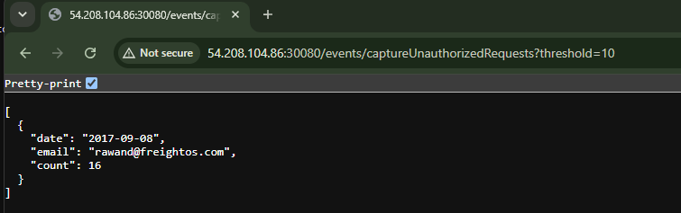

# Assignment 1: CI/CD pipeline for suspicious-events-detector

1. **CI/CD pipeline flow diagram** — [docs/freightos-pipline.png](docs/freightos-pipline.png)

   
2. **Dockerfile** — [Dockerfile](Dockerfile)
3. **Jenkins pipeline file** — [Jenkinsfile](Jenkinsfile)
4. **Kubernetes deployment files** — [k8s/](k8s/)
5. **Full console output for a successful Jenkins pipeline run** — [docs/jenkins-console-output.txt](docs/jenkins-console-output.txt)
6. **API output screenshot, `threshold=10`** — [media/API-output.png](media/API-output.png)

   
7. **Additional test cases** — [SuspiciousEventsServiceTest.java](src/test/java/com.freightos.suseventsdetector/service/SuspiciousEventsServiceTest.java),
   covering:
   - a documented gap where the default `isAuthorized: true` query misses repeated **failed** auth attempts
     (`hacker1@hacking.com`, `hackerdemo@hacking.com`, `rawan@testdomain.com` in the seed data)
   - the same accounts correctly caught via the `queryString` overload with `isAuthorized: false`
   - the `count > threshold` boundary being exclusive (a count equal to the threshold is not flagged)
   - a single event never being flagged as "repeated" activity
   - multiple groups being filtered independently by the same threshold, with results ordered by date
   - **a credential-stuffing IP (`58.245.25.156`) hitting 20+ distinct accounts is structurally invisible**,
     since detection only ever groups by `(date, email)` and `UnauthorizedUser` has no `ip` field at all
   - **one identity (`royce20@witting.org`) authenticating from 6 IPs across 6 countries in ~6 minutes** —
     a textbook impossible-travel signature — goes undetected, since nothing inspects `ip`/`country` per identity
   - **low-and-slow abuse spread across many distinct calendar dates** (`normaluser@testin.com`, 11 events
     over 10 months, peaking at only 2-in-a-day) never accumulates, because the per-day grouping resets the
     count every day
   - a stored XSS/cookie-injection payload in the `uri` field (`javascript:void(document.cookie=...)`) is
     persisted and returned verbatim, with no validation or sanitization on that field

   The last three document real detection gaps found while reviewing the full seed dataset (see the
   `-- Same ip different emails...` comment directly in [import.sql](src/main/resources/import.sql)) — they
   pass today by asserting the gap exists, not by asserting correct detection, since no IP-aware or
   cross-day aggregation currently exists in [EventRepository](src/main/java/com/freightos/suseventsdetector/EventRepository.java).
